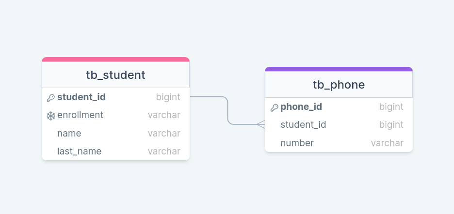

# 👨‍💻‍Sobre o projeto

Esse projeto é inspirado no [desafio técnico](https://github.com/Forleven/backend-developer-test)
da [Forleven](https://site.forleven.com/) para desenvolvedores backend.

Através dessa API é possível criar, buscar, atualizar e deletar estudantes.

## 💿Como rodar na sua máquina

<details>
    <summary><b>🐳Utilizando Docker (Recomendado)</b></summary>

**Pré-requisitos:**

- **Git**;
- **Docker + Docker Compose**.

```shell
# Clone o repositório na sua máquina
$ git clone https://github.com/lleonardus/student-manager.git

# Abra a pasta do projeto
$ cd student-manager

# Inicie o projeto usando Docker
$ docker-compose up -d
```

Após esse processo, a API vai estar rodando em **http://localhost:8080**
e a documentação estará disponível em **http://localhost:8080/swagger-ui.html**.

</details>

<details>
    <summary><b>♨️Utilizando Maven</b></summary>

**Pré-requisitos:**

- **Git**;
- **Maven**;
- **Java 17**;
- **PostgreSQL**.

```shell
# Clone o repositório na sua máquina
$ git clone https://github.com/lleonardus/student-manager.git

# Abra a pasta do projeto
$ cd student-manager

# Inicie o projeto usando Maven
$ mvn spring-boot:run
```

Após esse processo, a API vai estar rodando em **http://localhost:8080** e
a documentação estará disponível em **http://localhost:8080/swagger-ui.html**
</details>

Obs: Caso não queira utilizar nenhuma das opções acima, ainda é possível rodar o projeto utilizando
uma IDE da sua preferência (Intellij, Eclipse...)

## 💾Banco de Dados


O banco utilizado na aplicação é o **PostgreSQL**. Para saber mais sobre as suas configurações, vá em
`src/main/resources/application.properties` e também em `docker-compose.yml` (caso esteja usando Docker).

## 🎯Endpoints

### 👨‍🎓Student

- **GET** `/students`: Retorna uma lista de estudantes baseada nos parâmetros passados (id, enrollment, name e lastName).
- **GET** `/students/{enrollment}`: Retorna um estudante com base na matrícula passada.
- **POST** `/students`: Registra uma novo estudante.
- **PUT** `/students/{id}`: Atualiza os campos enrollment, name e lastName de um estudante.
- **DELETE** `/students/{id}`: Deleta um estudante em específico.

## 🧰Ferramentas Utilizadas

- [Java 17](https://www.oracle.com/java/technologies/javase/jdk17-archive-downloads.html)
- [Spring Boot](https://spring.io/)
- [Spring Data JPA](https://docs.spring.io/spring-data/jpa/docs/current/reference/html/)
- [PostgreSQL](https://www.postgresql.org/)
- [SpringDoc OpenAPI](https://springdoc.org/v2/)
- [Docker](https://www.docker.com/products/docker-desktop/)
- [Maven](https://maven.apache.org/)
- [Lombok](https://projectlombok.org/)